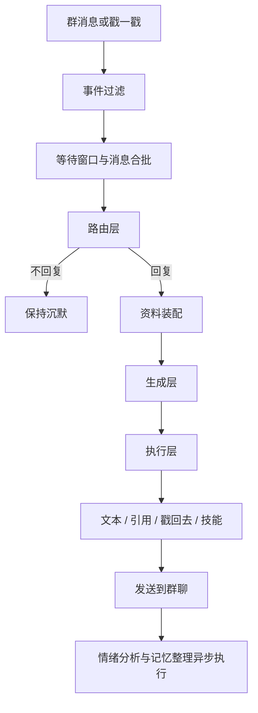
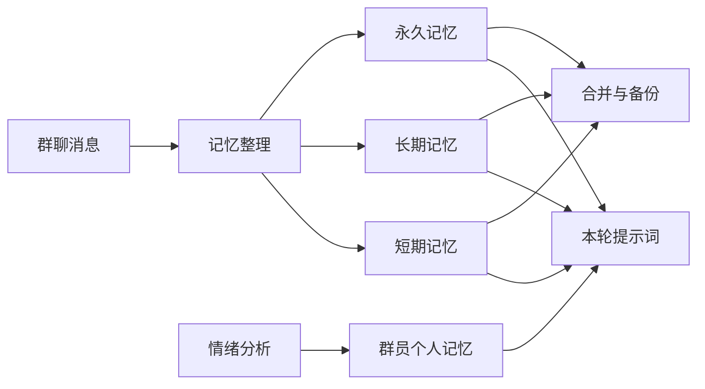
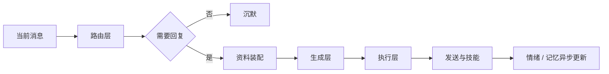

# MBB-Roleplay

MoBoxBot 角色扮演插件。插件读取 persona 文件，让角色以普通群成员的方式参与群聊，并维护记忆、情绪、用户关系和外部技能。

本页是总览。命令、记忆、情绪、集成、配置和多角色部署分别见分册。

## 功能分区

| 分区 | 主要能力 | 详细文档 |
|---|---|---|
| 会话与回复 | 群级开关、参与概率、冷却、消息合批、路由判断、引用回复、结构化输出 | [回复架构](../docs/roleplay/architecture.md) |
| 记忆系统 | 短期、长期、永久、群员个人记忆；相关性注入、合并、备份与恢复 | [记忆系统](../docs/roleplay/memory.md) |
| 情绪与关系 | 群级情绪、好感、信任、厌烦、黑名单、用户关系原因 | [情绪与关系](../docs/roleplay/emotion.md) |
| 资料与提示词 | persona、台词语料、知识库、提示词缓存前缀 | [回复架构](../docs/roleplay/architecture.md) / [技能与集成](../docs/roleplay/integrations.md) |
| 技能与外部插件 | 提醒、识图、表情包、ComfyUI 生图、戳回去 | [技能与集成](../docs/roleplay/integrations.md) |
| 多角色部署 | 其他角色机器人 QQ、接话概率、连续往返限制、名称识别 | [多角色部署](../docs/roleplay/multi-role.md) |
| 免打扰 | 群员自助加入名单，角色不再主动搭话，只回应主动叫到自己的消息 | [命令](../docs/roleplay/commands.md) |
| 命令与配置 | 全部管理命令、配置项、默认性能、构建和升级 | [命令](../docs/roleplay/commands.md) / [配置与部署](../docs/roleplay/configuration.md) |

## 核心流程



路由层只判断“要不要回复、带哪些技能、带哪些资料”，固定规则保留否决权。被直接艾特、被引用回复、冷却状态等硬规则不会被模型推翻。

## 记忆结构



记忆只作为背景资料注入，不等于每轮都要复述。短期记忆偏近期事件，长期记忆偏群内结论，永久记忆跨群共享，群员个人记忆按 `(群号, QQ)` 维护。

## 分层回复



- 路由层：判断指向、兴趣、技能和资料，保持轻量。
- 资料层：persona、记忆、群员印象、最近上下文、语料、知识库按预算注入。
- 生成层：生成纯文本回复和表达动作，不输出 Markdown 或思考过程。
- 执行层：发送文本、引用、戳回去、提醒、表情包或生图等技能。
- 风格层：按需改写 AI 味明显的回复，默认不改变事实。

## 快速开始

```text
/role enable
/role status
/role persona
/role reload
```

详细命令见 [命令分册](../docs/roleplay/commands.md)。

## 依赖与集成

| 插件 | 关系 | 用途 |
|---|---|---|
| `MBB-AI` | 必需 | 路由、回复、记忆、情绪、提醒识别等模型调用 |
| `MBB-Vision` | 可选 | 图片与表情包识图、缓存和原图上下文 |
| `MBB-Sticker` | 可选 | 表情包标签检索与发送 |
| `MBB-ComfyUI` | 可选 | 生图技能与生成完成回调 |

没有可选插件时，Roleplay 仍可使用文本聊天、记忆、情绪和提醒功能。

## 免打扰名单

名单内的群员不会被角色主动搭话：只有对方主动叫到角色（艾特、引用角色消息或用到角色名）时才回复，其他消息一律保持沉默，其他群员不受影响。与黑名单的区别是黑名单完全屏蔽该用户的消息和戳一戳，免打扰只关闭主动搭话。

```text
/role quiet add
/role quiet remove
/role quiet list
```

群员可以自己加入和退出名单；把他人加入名单、开关名单和清空名单需要机器人管理员。名单按群隔离，每个群的开关用 `/role quiet on|off` 单独保存；`quietReplyEnable` 只决定新群的默认开关。被免打扰的消息不进入上下文、不触发记忆整理和识图，角色不会记住这些内容。

推荐知识库：

[MossCG/MBB-Knowledge](https://github.com/MossCG/MBB-Knowledge)

把仓库中的 `knowledge/` 复制到 `plugins/MBB-Roleplay/knowledge/`，再执行 `/role kb reload` 即可使用。

persona 与台词语料由 `MBB-Persona` 私有仓库单独维护：`personas/` 复制到 `plugins/MBB-Roleplay/`，`corpus/` 复制到 `plugins/MBB-Roleplay/speech-corpus/`。

## 文档分册

| 文档 | 内容 |
|---|---|
| [回复架构](../docs/roleplay/architecture.md) | 路由、分层处理、消息合批、结构化输出、提示词缓存、重复拦截 |
| [记忆系统](../docs/roleplay/memory.md) | 四份记忆的分工、永久记忆、记忆标记、备份与清空 |
| [情绪与关系](../docs/roleplay/emotion.md) | 情绪基线、好感、信任、厌烦、黑名单和关系命令 |
| [技能与集成](../docs/roleplay/integrations.md) | 戳一戳、引用、提醒、台词语料、知识库和外部插件 |
| [多角色部署](../docs/roleplay/multi-role.md) | 多个角色机器人同群的识别和接话控制 |
| [命令分册](../docs/roleplay/commands.md) | 全部 `/role`、`/reminder` 命令 |
| [配置与部署](../docs/roleplay/configuration.md) | persona、配置项、默认性能、依赖、构建和升级 |

## 构建

```powershell
.\build.ps1
```

产物：

```text
out\MBB-Roleplay.jar
```
